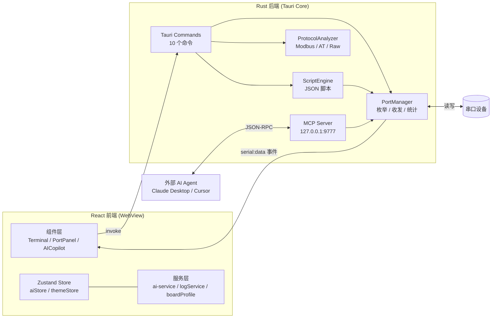

# SerialPilot

**AI 协同串口调试工具 · 面向嵌入式开发者**

[](https://github.com/Fenghu146/serialpilot/actions/workflows/ci.yml)
[](LICENSE)
[](https://tauri.app)
[](https://www.rust-lang.org)
[](https://react.dev)
[](package.json)

> **SerialPilot** 是一款基于 Tauri 2.0 的跨平台串口调试工具。它在传统串口助手
> 的基础上，融合了 AI 对话分析、协议自动解析、脚本自动化与 MCP Server 能力，
> 帮助嵌入式开发者更快地排查丢包、乱码、校验错误与通信异常。

<!-- 截图（可选）：将应用截图保存为 docs/screenshot.png，然后取消下面这行注释 -->
<!--  -->

---

## 目录

- [项目简介](#项目简介)
- [主要功能](#主要功能)
- [技术架构](#技术架构)
- [安装与使用](#安装与使用)
- [配置要求](#配置要求)
- [目录结构](#目录结构)
- [开发与测试](#开发与测试)
- [Roadmap](#roadmap)
- [贡献指南](#贡献指南)
- [许可证](#许可证)

---

## 项目简介

嵌入式开发过程中，串口是查看启动日志、调试 AT 指令、验证 Modbus 通信最常用的
通道，但传统串口助手只负责"显示与发送"，所有报文解读、异常定位都依赖开发者经验。

SerialPilot 将「串口终端」与「AI 协同」结合：

- 终端本身提供完整的收发、格式化、高亮、导出与回放能力；
- 内置协议分析引擎可自动识别 Modbus RTU/TCP、AT 指令并校验 CRC；
- AI 助手可读取当前开发板型号与终端选中的日志，给出针对性的排查建议；
- 通过 MCP Server 把串口能力暴露给 Claude Desktop / Cursor 等外部 AI Agent。

前端使用 React + TypeScript 构建，后端为 Rust，二者通过 Tauri 的
命令（`invoke`）与事件（`serial:data`）通信，全部业务逻辑在本地运行。

## 主要功能

### 1. 串口终端

- 自动枚举本机串口，展示 USB 设备的 `VID/PID`、厂商与产品名
- 热插拔检测（每 3 秒刷新列表）
- 完整通信参数配置：波特率、数据位、停止位、校验位、流控
- 文本 / 十六进制（HEX）双模式发送，支持定时循环发送
- 发送历史记录：下拉列表选择，或使用 `↑` / `↓` 快速回溯
- 毫秒级时间戳、TX/RX 分色显示、自动滚动与滚动暂停
- 终端语法高亮：AT 指令、OK/ERROR/WARN 关键字、十六进制、IP/MAC、
  GPIO 引脚、寄存器地址等，可一键开关

### 2. AI 智能协同（核心特色）

- 支持 OpenAI、Anthropic (Claude)、Ollama（本地）以及任意 OpenAI 兼容端点
- 流式输出，逐字返回，支持中断与多轮对话
- 在终端选中日志后可通过右键菜单「提交 AI 分析」
- 自动根据 USB `VID/PID` 与设备名识别开发板（ESP32-C3、Arduino Uno、
  STM32F4xx、ESP8266、i.MX6ULL、K210、RP2040 等），并注入对应的
  AT 指令表、调试技巧与常见问题到提示词中
- 可自定义 System Prompt 与上下文日志条数

### 3. 协议分析引擎

- Modbus RTU / Modbus TCP 帧解析，支持寄存器与线圈值解码
- AT 指令与响应的结构化解析
- 自动协议识别，未知帧回退为原始数据分析
- 校验和计算：CRC8、CRC16-CCITT、CRC16-Modbus、XOR8/16、SUM8/16
- 输出字段偏移、含义说明与异常提示（CRC 失败、ERROR 响应等）

### 4. 脚本自动化

- 使用 JSON 描述测试流程，支持以下步骤：

  | action | 说明 |
  | --- | --- |
  | `send` | 发送文本（可指定 `mode`） |
  | `send_hex` | 发送十六进制数据 |
  | `wait` | 等待指定毫秒数 |
  | `assert_response` | 在超时时间内等待响应包含指定内容 |
  | `assert_equal` | 断言接收到的响应与期望值相等 |
  | `print` | 输出一条提示信息 |

- 一键运行，实时输出执行日志，并生成包含通过/失败与耗时的测试报告

### 5. 日志导出与复盘

- 导出为 `TXT` / `CSV` / `JSON` 三种格式，JSON 附带会话元数据统计
- 导入历史日志（`txt` / `log` / `json`）后可直接回放
- 回放支持播放/暂停、逐条跳转、进度拖拽与 `0.5x`–`10x` 变速

### 6. MCP Server

- 基于 JSON-RPC 2.0（MCP 协议版本 `2024-11-05`），监听 `127.0.0.1:9777`
- 对外提供 9 个工具，供外部 AI Agent 直接操作串口
- 内置 Claude Desktop 配置片段，可在应用内一键查看

### 7. 主题与体验

- 深色 / 浅色主题一键切换，基于 CSS 变量，切换无需刷新
- 标准模式（纯终端）与 AI 协同模式（右侧对话面板）自由切换

## 技术架构

### 技术选型

| 层级 | 技术 |
| --- | --- |
| 桌面壳 / 后端 | Tauri 2.0、Rust 2021 |
| 前端框架 | React 18 + TypeScript 5 |
| 构建工具 | Vite 5 |
| 样式方案 | TailwindCSS 3（`darkMode: class` + CSS 变量） |
| 状态管理 | Zustand 4（`persist` 持久化） |
| 串口通信 | `serialport` crate（异步 tokio 驱动） |
| 图标 | lucide-react |
| 协议解析 | 纯 Rust 实现（无外部协议库） |

### 架构总览



### 前后端通信

- **命令（前端 → 后端）**：通过 `@tauri-apps/api/core` 的 `invoke` 调用，参数
  在 JS 侧使用 camelCase，Rust 侧自动映射为 snake_case。
- **事件（后端 → 前端）**：后端通过 `handle.emit` 推送 `serial:data` 事件，
  payload 为 `LogEntry`；前端使用 `listen<LogEntry>("serial:data")` 接收，
  终端保留最近 2000 条记录。

### Tauri 命令一览

| 命令 | 参数 | 说明 |
| --- | --- | --- |
| `list_ports` | - | 枚举可用串口 |
| `open_port` | `portName`, `config` | 打开串口并应用参数 |
| `close_port` | - | 关闭串口 |
| `write_port` | `data`, `mode` | 发送数据（`Text` / `Hex`） |
| `get_connection_status` | - | 获取连接状态与收发字节数 |
| `analyze_frame` | `hexData`, `protocolHint` | 分析帧结构（自动检测协议） |
| `compute_checksum_cmd` | `hexData`, `algo` | 计算校验和 |
| `parse_modbus` | `hexData`, `isTcp` | 以 Modbus 语义解析 |
| `run_script` | `script` | 执行 JSON 自动化脚本 |
| `get_mcp_info` | - | 获取 MCP Server 信息 |

### MCP 工具一览

`list_ports`、`connect`、`disconnect`、`send`、`send_hex`、`send_command`、
`read`、`status`、`analyze_frame`。

## 安装与使用

### 环境要求

| 依赖 | 版本 | 说明 |
| --- | --- | --- |
| [Rust](https://www.rust-lang.org/tools/install) | stable（Tauri 2 要求 1.77.2+） | 编译后端 |
| [Node.js](https://nodejs.org/) | 20+ | 构建前端 |
| [WebView2](https://developer.microsoft.com/microsoft-edge/webview2/) | - | Windows 运行时（Win11 自带） |
| 系统依赖 | - | Linux 见 [BUILD.md](BUILD.md) |

### 开发模式

```bash
# 1. 克隆仓库
git clone https://github.com/Fenghu146/serialpilot.git
cd serialpilot

# 2. 安装前端依赖
npm install

# 3. 启动开发模式（自动拉起 Vite 与 Tauri 窗口）
npm run tauri:dev
```

### 生产构建

```bash
# 构建安装包，产物位于 src-tauri/target/release/bundle/
npm run tauri:build
```

各平台产物：Windows `.msi`、macOS `.dmg`、Linux `.AppImage` / `.deb`。
详细前置条件与步骤见 [BUILD.md](BUILD.md)。

### 使用示例

**1）连接串口**

在顶部工具栏选择串口与通信参数（默认 `115200 8N1`），点击「连接」。
连接成功后状态栏会显示端口、参数与实时 TX/RX 字节数。

**2）发送数据**

在底部输入框输入内容，勾选 `HEX` 切换十六进制模式，`Ctrl+Enter` 或
`Shift+Enter` 发送；勾选「定时」可按指定间隔循环发送。

**3）协议分析**

点击终端右上角的协议分析图标，粘贴十六进制报文（如
`01 03 00 00 00 0A C5 CD`），选择协议类型（默认自动检测）后点击「分析」，
即可查看字段解析、CRC 校验结果与异常提示。

**4）配置 AI 协同**

点击右上角齿轮图标，选择服务商、填写 API Key 与模型，再切换到 AI 模式。
在终端中选中日志后右键「提交 AI 分析」，AI 会结合当前开发板信息给出建议。

**5）运行自动化脚本**

点击终端工具栏的脚本图标，编辑 JSON 脚本后点击「运行脚本」：

```json
{
  "name": "ESP32 AT 测试",
  "description": "测试 ESP32 基本 AT 指令",
  "steps": [
    { "action": "send", "data": "AT\r\n", "description": "测试连接" },
    { "action": "wait", "ms": 500 },
    { "action": "assert_response", "contains": "OK", "description": "检查 AT 应答" },
    { "action": "print", "message": "测试完成" }
  ]
}
```

## 配置要求

### AI 服务商配置

| 服务商 | 默认端点 | 是否需要 API Key |
| --- | --- | --- |
| OpenAI | `https://api.openai.com/v1` | 是 |
| Anthropic | `https://api.anthropic.com` | 是 |
| Ollama（本地） | `http://localhost:11434/v1` | 否 |
| 自定义（OpenAI 兼容） | 自行填写 | 取决于服务 |

配置项（服务商、模型、端点、API Key、上下文日志数、自定义 System Prompt）
通过 Zustand `persist` 保存在本机 `localStorage`，键名为 `serialpilot-ai`。

> **安全提示**：API Key 仅存储在本机，用于前端直接请求 AI 服务商；请勿在共享
> 设备上保存密钥，并注意浏览器 WebView 的本地存储安全边界。

### MCP 集成配置

在 Claude Desktop 等 MCP 客户端的配置文件中添加：

```json
{
  "mcpServers": {
    "serialpilot": {
      "command": "nc",
      "args": ["127.0.0.1", "9777"]
    }
  }
}
```

> MCP Server 随应用启动，固定监听 `127.0.0.1:9777`（仅本机可访问）。
> Windows 用户如无 `nc`，可改用支持 TCP 的 MCP 客户端或转发工具。

### 串口默认参数

| 参数 | 默认值 | 可选范围 |
| --- | --- | --- |
| 波特率 | 115200 | 300 – 921600 |
| 数据位 | 8 | 5 / 6 / 7 / 8 |
| 停止位 | 1 | 1 / 2 |
| 校验位 | None | None / Odd / Even / Mark / Space |
| 流控 | None | None / Software / Hardware |

> 说明：底层 `serialport` crate 不支持 Mark / Space 校验，选择这两项时会退化为
> `None`，请以实际通信结果为准。

## 目录结构

```text
serialpilot/
├── .github/workflows/ci.yml        # CI：多平台测试 + Release 打包
├── src/                            # 前端（React + TypeScript）
│   ├── components/
│   │   ├── AICopilot/              # AI 面板与设置
│   │   ├── ScriptEditor/           # 脚本编辑器
│   │   ├── LogPanel.tsx            # 日志导出 / 导入 / 回放
│   │   ├── McpStatus.tsx           # MCP 状态与配置展示
│   │   ├── ModeToggle.tsx          # 标准 / AI 模式切换
│   │   ├── PortPanel.tsx           # 串口选择与参数配置
│   │   ├── ProtocolPanel.tsx       # 协议分析与校验和计算
│   │   ├── SendPanel.tsx           # 发送面板
│   │   ├── StatusBar.tsx           # 状态栏与收发统计
│   │   ├── Terminal.tsx            # 终端显示与高亮
│   │   └── ThemeToggle.tsx         # 主题切换
│   ├── services/
│   │   ├── ai-service.ts           # 多服务商流式对话
│   │   ├── boardProfileService.ts  # 开发板画像与自动识别
│   │   └── logService.ts           # 日志导入导出与元数据
│   ├── stores/
│   │   ├── aiStore.ts              # AI 状态（持久化）
│   │   └── themeStore.ts           # 主题状态（持久化）
│   ├── types/
│   │   └── ai.ts                   # AI 相关类型定义
│   ├── utils/
│   │   └── highlighter.ts          # 终端语法高亮
│   ├── App.tsx                     # 根组件与串口状态
│   ├── main.tsx                    # 入口与主题注入
│   ├── styles.css                  # 主题变量与工具类
│   └── types.ts                    # 共享类型与选项常量
├── src-tauri/                      # 桌面壳与后端（Rust）
│   ├── src/
│   │   ├── lib.rs                  # 库入口，导出 serial 模块
│   │   ├── main.rs                 # Tauri 应用入口与命令
│   │   └── serial/
│   │       ├── mod.rs              # 模块聚合
│   │       ├── analyzer.rs         # 协议分析引擎
│   │       ├── checksum.rs         # 校验和算法与十六进制工具
│   │       ├── mcp.rs              # MCP Server
│   │       ├── modbus.rs           # Modbus 帧解析
│   │       ├── port_manager.rs     # 串口生命周期与收发
│   │       ├── script.rs           # JSON 脚本引擎
│   │       └── types.rs            # 后端数据结构
│   ├── tests/
│   │   └── integration_test.rs     # 集成测试
│   ├── icons/                      # 应用图标
│   ├── build.rs
│   ├── Cargo.toml
│   └── tauri.conf.json             # 应用与打包配置
├── BUILD.md                        # 各平台构建说明
├── CONTRIBUTING.md                 # 贡献指南
├── index.html
├── package.json
├── tailwind.config.js
├── postcss.config.js
├── tsconfig.json
└── vite.config.ts
```

## 开发与测试

```bash
npm run tauri:dev      # 开发模式（Vite + Tauri）
npm run dev            # 仅启动前端（浏览器调试，无后端能力）
npm run build          # 前端类型检查 + 生产构建

cd src-tauri
cargo test             # 运行单元测试与集成测试
cargo clippy           # 静态检查
cargo fmt              # 代码格式化
```

CI（`.github/workflows/ci.yml`）会在 Windows / Ubuntu / macOS 三个平台上执行
`cargo test`、`npx tsc --noEmit` 与 `npm run build`，并在发布 Release 时自动
打包各平台安装包。

## Roadmap

- [ ] 接收数据的 HEX 自动判定与显示
- [ ] 协议分析结果一键跳转 / 复制字段
- [ ] 更多内置开发板画像与外设模板
- [ ] 脚本编辑器语法高亮与变量支持
- [ ] Mark / Space 校验位支持（依赖底层库）
- [ ] 通过后端代理能力增强 AI 请求的安全性与可观测性

## 贡献指南

欢迎提交 Issue 与 Pull Request。开始之前请阅读 [CONTRIBUTING.md](CONTRIBUTING.md)。

快速约定：

1. Fork 仓库并基于 `main` 创建功能分支：`git checkout -b feature/xxx`
2. 遵循现有代码风格；Rust 侧使用 `rustfmt` + `clippy`，前端使用 TailwindCSS 工具类
3. 提交信息遵循约定式提交：`feat:` / `fix:` / `docs:` / `refactor:` / `test:` / `chore:`
4. 提交前确保 `cargo test`、`npx tsc --noEmit` 与 `npm run build` 均通过
5. 发起 Pull Request 并描述改动动机与影响范围

## 许可证

本项目基于 [MIT License](LICENSE) 开源，Copyright (c) 2026 SerialPilot Team。
